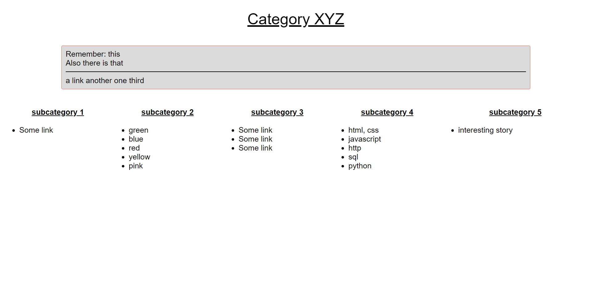

# offline_organizer
A very simple offline organizer/planer.

To use it you have to create and edit your html files directly.

The todo list of index.html uses [local storage](https://developer.mozilla.org/en-US/docs/Web/API/Window/localStorage).

